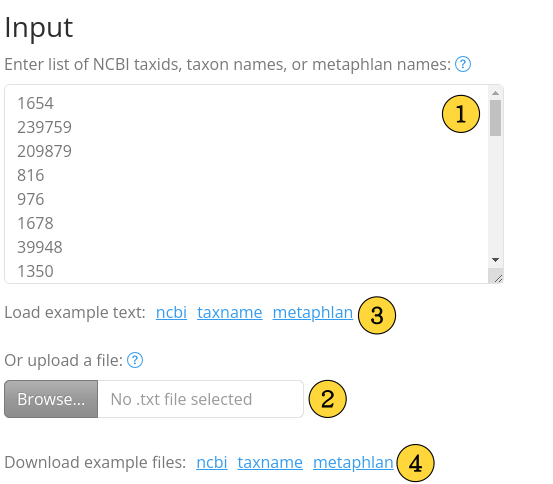
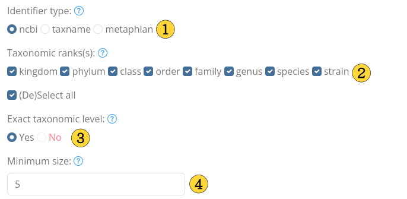
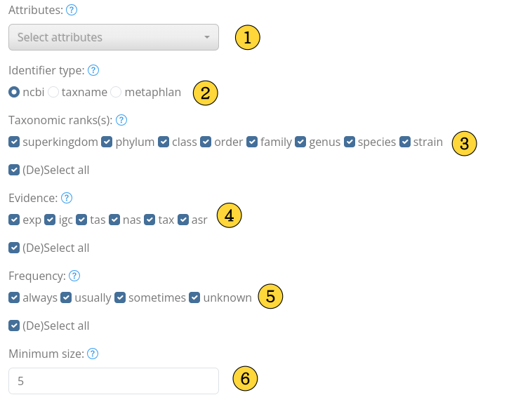
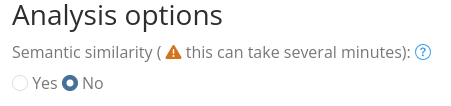
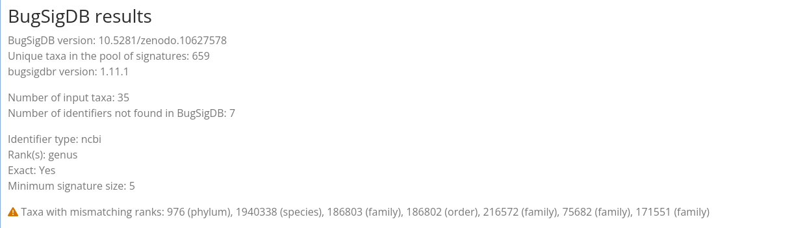
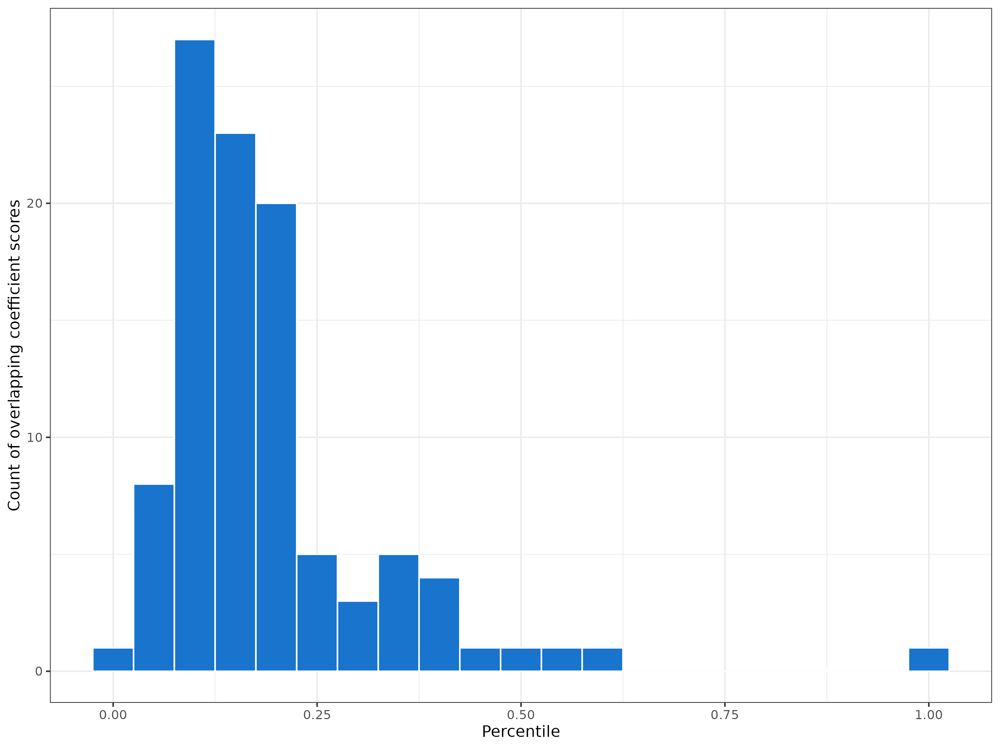

# BugSigDBEnrich Help 

**Links**

+ [BugSigDBEnrich app](https://shiny.sph.cuny.edu/BugSigDBEnrich/)
+ [Source code](https://github.com/waldronlab/BugSigDBEnrich)
+ [Bugs report](https://github.com/waldronlab/BugSigDBEnrich/issues)

**Contents** 

+ [Introduction](#intro) 
+ [Input](#input) 
+ [Database options](#dboptions) 
    * [BugSigDB options](#bsdboptions) 
    * [Bugphyzz options](#bugphyzzoptions) 
+ [Analysis options](#analysisoptions) 
+ [Action buttons](#actions) 
+ [Results](#results) 
    * [Results header](#resheader) 
    * [Results table](#restable) 
* [Error/warning messages](#messages) 
+ [HTTP GET](#httpget) 

## Introduction 

The BugSigDBEnrich app allows the comparison of a list of microbes with
[BugSigDB](https://bugsigdb.org/), a manually curated database of microbial
signatures from published studies. It also enables comparisons with [Bugphyzz](https://github.com/waldronlab/bugphyzz),
which provides annotations of physiological and other phenotipic bacterial
traits.

## Input 

The app's input is a list of taxon identifiers that can be entered into
the text box, one identifier per line (**Figure 1-1**).

Alternatively, a text file (*.txt) with identifiers can be uploaded with the
`Browse` button, one identifier per line (**Figure 1-2**).

Indentifiers can be of three types:

+ **ncbi**. An NCBI taxonomy ID (or taxid). For example, 562.
Learn more at the <a href="https://www.ncbi.nlm.nih.gov/books/NBK53758/" target="_blank">NCBI site</a>. 
+ **taxname**. A scientific name from the NCBI taxonomy.
For example, _Escherichia coli_.
Learn more at the <a href="https://www.ncbi.nlm.nih.gov/books/NBK53758/" target="_blank">NCBI site</a>. 
+ **metaphlan**. A taxonomy name in the metaphlan format.
This format contains the full taxonomy of the taxon separated by 
`|\\w__`, which can be one of the following: k = kingdom, 
p = phylum, c = class, o = order, f = family, g = genus, s = species,
t = strain. For example, 
`k__Bacteria|p__Pseudomonadota|c__Gammaproteobacteria|o__Enterobacterales|f__Enterobacteriaceae|g__Escherichia|s__Escherichia_coli`. 

> ❌ Identifier types cannot be mixed in the same input.

For detailed examples, click on the links below the input box to
fill in the input box (**Figure 1-3**) or click on the links below the `Browse` button to download
an example file to your machine (**Figure 1-4**).

**Figure 1**. Input.

[Back to the top](#top) ⬆️

## Database options 

BugSigDBEnrich implements the [bugsigdbr](https://github.com/waldronlab/bugsigdbr)
and [bugphyzz](https://github.com/waldronlab/bugphyzz) packages to
obtain bug signatures, each with their own options.

[Back to the top](#top) ⬆️

### BugSigDB options

**Identifier type**. BugSigDB signatures will be created with the chosen type
of identifier. The selected identifier type must match the input type
(**Figure 2-1**).

**Taxonomic rank(s)**. This option selects the taxonomic ranks allowed in
the BugSigDB signatures. The `(De)select all` checkbox can help to quickly
check/uncheck all ranks (**Figure 2-2**). 

**Exact taxonomic level**. If `Yes` is selected, the BugSigDB signatures will
only contain taxa of the selected ranks (above) that were manually curated in
the database. The `No` option, which can only be used with a single taxonomic
rank, will cut the taxonomic tree to the checked rank. This allows
the inclusion of parent taxa in the signatures even if they were not manually
curated in BugSigDB (**Figure 2-3**).

Let’s use the signature [bsdb:1\/2\/1](https://bugsigdb.org/Study_1/Experiment_2/Signature_1)
as an example. This signature contains only two elements manually curated in
BugSigDB: _Anaerostipes_ (genus) and _Lacticaseibacillus zeae_ (species).

"Exact taxonomic rank" set to "Yes":

+ If "genus" is checked, only _Anaerostipes_ will be included. 
+ If "species" is checked, only _Lacticaseibacillus zeae_ will be included. 
+ If both "genus" and "species" are checked, both _Anaerostipes_ and
_Lacticaseibacillus zeae_ will be included. 
+ If all ranks are checked, both taxa will be included and nothing else
as no other taxa were manually annotated for this signature.

"Exact taxonomic rank" set to "No":

* If "genus" is checked, the signature will include *Anaerostipes*
(manually curated) and *Lacticaseibacillus* (not manually curated),
which is the parent genus of *Lacticaseibacillus zeae* (manually curated).

> ⚠️ When "No" is selected, the taxonomic tree is truncated, allowing the
annotation of a taxon to be extended to its parent. However, this process
does not follow a formal propagation algorithm.
The tree could be truncated at the "kingdom" level, resulting in a signature
that only includes the Bacteria domain, which might not be the desired result.

**Minimum size**. Filter the target BugSigDB signatures based on their
number of elements. The default is 5, meaning that only signatures with at
least five taxon identifiers fulfilling all of the options above will be
included in the analysis (**Figure 2-4**).

**Figure 2.** BugSigDB options.

[Back to the top](#top) ⬆️

 ### Bugphyzz options

**Attributes**. Each attribute represents a phenotipic trait and its possible
values. For example, the areophilicity attribute can have "areobic",
"anaerobic", and "facultatively anaerobic" values. A signature of microbes will
be craeted for each attribute value (**Figure 3-1**).

**Identifier type**. Bugphyzz signatures will be created with the chosen type
of identifier. The selected identifier type must match the input type
(**Figure 3-2**).

**Taxonomic rank(s)**. This option selects the taxonomic
ranks allowed in the Bugphyzz signatures. The `(De)select all` checkbox can
help to quickly check/uncheck all ranks (**Figure 3-3**).

**Evidence**. Type of evidence backing up bugphyzz
annotations (**Figure 3-4**):

| Evidence code | Description |
| ------------- | ----------- |
| exp | Wet lab experimental data. |
| igc | Inferred from genomic context. |
| tas | Traceable author statement. |
| nas | Non-traceable author statement. |
| tax | Used as synonym for IBD: Inferred from Biological aspect of Descendant. |
| asr | Inferred through ancestral state reconstruction. |

Learn more about ontology evidence codes [here](https://geneontology.org/docs/guide-go-evidence-codes/).

**Frequency**. Keywords reprsenting estimators of the probability or
confidence interval of the annotations in bugphyzz. (**Figure 3-5**):

| Frequency code | Description |
| -------------- | ----------- |
| always | >= 0.9 |
| usually | >= 0.8 & < 0.9|
| sometimes | >= 0.4 < 0.8 |
| unknown | Not enough information to determine. |

**Minimum size**. Filter the target Bugphyzz signatures based on their
number of elements. The default is 5, meaning that only signatures with at
least five taxon identifiers fulfilling all of the options above will be
included in the analysis (**Figure 3-6**).

**Figure 3**. Bugphyz options.

[Back to the top](#top) ⬆️

## Analysis options 

You can opt to include a semantic similarity analysis in your results
(see the "Results" section below). This will load the NCBI taxonomy ontology
and run a semantic similarity analysis. This could take
several minutes, but after the first run the database will still be loaded,
reducing the time of subsequent runs (as long the page is not refreshed or 
the "Reset app" button is not clicked.)

**Figure 4**. Analysis options.

[Back to the top](#top) ⬆️

## Action buttons 

+ **Analyze**. Click on the "Analyze" button when the input and signature options are ready.
+ **Download results**. After the analysis has been run, the "Download result" button will be 
available for downloading the result table in a text file with tab separated
values (.tsv extension).
+ **Reset app**. Use the "Reset app" button to restart the app. This is equivalent to 
refreshing the page in the brwoser (e.g., pressing F5).

[Back to the top](#top) ⬆️

## Results 

### Results header 

The results header contains information about the database, such as version
and number of unique taxa in the signature pool (**Figure 6**).

It also contains the summary of the selected options.

If you get a warning message with "Mismatching taxa ranks", you'll find which
taxa have mismatching ranks in this section.

> ⚠ A "Mismatching ranks" warning message means that the input contained
taxa of ranks different to the one in the signatures, so these taxa didn't 
actually contributed to the calculation of the metrics in the results table
(section below).

**Figure 6**. Results header.

[Back to the top](#top) ⬆️

### Results table 

| Column | Description | Database |
| ------ | ----------- | -------- |
| Signature | Signature name. When clicked, you'll be able to see the taxa overlaps between sets. | BugSigDB, Bugphyzz |
| JI | Jaccard Index. | BugSigDB, Bugphyzz |
| OC | Overlapping coefficient. | BugSigDB, Bugphyzz |
| OCPer | Percentile of OCs based on BugSigDB signatures. | BugSigDB, Bugphyzz |
| Size | Signature size. | BugSigDB, Bugphyzz|
| Study | The study number. When clicked, this will redirect to the BugSigDB study page. | BugSigDB |
| SigLink | Signaure ID. When clicked, this will redirect to the BugSigDB signature page. | BugSigDB |
| SemSim | Semantic similarity. | BugSigDB, Bugphyzz |

The percentile (OCper) was determined by running an all-vs-all overlapping
coefficient (OC) analysis of all BugSigDB signatures with a minimum size of 5
(**Figure 7**).

**Figure 7**. Counts of overlapping coefficient (OC) values per percentile.

[Back to the top](#top) ⬆️

## HTTP GET 

BugSigDBEnrich accepts the HTTP GET method to get input data. When the
HTTP method is used, the app will:

1. Fill in the text box area with the parameters from the URL.
2. Automatically select the identifiers type
(based on the first identifier in the list).
3. Run the analysis (BugSigDB option) with default values.

After this, users can choose different paratemeters and re-run the app using
the same input.

Click for short examples with <a href="https://shiny.sph.cuny.edu/BugSigDBEnrich/?vector=12916,469,642,111142,1283313,1663" target="_blank">ncbi</a>,
<a href="https://shiny.sph.cuny.edu/BugSigDBEnrich/?vector=Acidovorax,Acinetobacter,Aeromonas,Alishewanella,Alloprevotella,Arthrobacter" target="_blanck">taxname</a>,
and <a href="https://shiny.sph.cuny.edu/BugSigDBEnrich/?vector=k__Bacteria%7Cp__Pseudomonadota%7Cc__Betaproteobacteria%7Co__Burkholderiales%7Cf__Comamonadaceae%7Cg__Acidovorax,k__Bacteria%7Cp__Pseudomonadota%7Cc__Gammaproteobacteria%7Co__Moraxellales%7Cf__Moraxellaceae%7Cg__Acinetobacter,k__Bacteria%7Cp__Pseudomonadota%7Cc__Gammaproteobacteria%7Co__Aeromonadales%7Cf__Aeromonadaceae%7Cg__Aeromonas,k__Bacteria%7Cp__Pseudomonadota%7Cc__Gammaproteobacteria%7Co__Alteromonadales%7Cf__Alteromonadaceae%7Cg__Alishewanella,k__Bacteria%7Cp__Bacteroidota%7Cc__Bacteroidia%7Co__Bacteroidales%7Cf__Prevotellaceae%7Cg__Alloprevotella,k__Bacteria%7Cp__Actinomycetota%7Cc__Actinomycetes%7Co__Micrococcales%7Cf__Micrococcaceae%7Cg__Arthrobacter" target="_blanck">metaphlan</a>
identifiers.

> ⚠️ Too many identifiers could potentially exceed the number of characters
allowed in the URL. This could be especially the case for metaphlan names.
In such case, saving the identifiers in a text file (see the input section)
is recommended or pasting directly in the text box.

[Back to the top](#top) ⬆️
